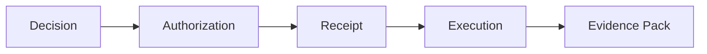

Absolutely. Below is your **clean, fully merged README**, ready to paste into the Keon repo.

It safely integrates:

* Behavioral governance
* Expression Gate
* Behavioral receipts
* Structural alignment with CGAE
* No doctrinal tone
* No scope creep
* No marketing inflation

It preserves your precision-first voice.

---

# Keon Systems: AI Governance Platform for Provable Execution and Compliance

### Governed Execution. Verifiable Decisions. Court-Defensible Proof.

---

## Why Keon Exists: Solving AI Governance and Forensics Challenges

AI systems have crossed a threshold.

They no longer just *advise* — they **trigger actions**:

* deployments
* account changes
* workflow execution
* infrastructure modification
* automated decisions with real consequences

Most “AI governance” solutions focus on:

* prompts
* alignment
* monitoring
* after-the-fact logs

Keon addresses a harder problem:

> **How do you prove, months or years later, that an AI-assisted action was explicitly authorized, policy-compliant, and executed under accountable human or system authority?**

This is not an observability problem.
It is a **forensics and accountability problem**—critical for AI compliance evidence, provable execution, and court-defensible proofs.

---

## What is Keon?

Keon is a **governance substrate** that sits *between intent and execution*.

It enforces a strict, mechanical boundary:

**Decision → Authorization → Receipt → Execution → Evidence**

Every governed action produces:

* an explicit authorization decision
* a cryptographic receipt
* a traceable audit record
* a verifiable evidence bundle suitable for investigation and review

If authorization is missing, ambiguous, or unverifiable — **execution does not occur**.

---

## What Keon is Not

Keon is intentionally narrow.

Keon does **not**:

* reason with LLMs
* generate plans or workflows
* initiate actions
* execute tasks
* replace compliance frameworks
* render legal judgments
* generate LLM content or dictate tone
* perform subjective alignment decisions

Keon exists to make **execution provable**, not intelligent — and to ensure that claims about authorization can be independently verified.

---

## How Governed Execution Works in Keon

In Keon’s model:

* AI outputs are treated as **requests**, not commands
* Execution is **fail-closed by default**
* Authority is **explicit**, never implied
* Evidence is a **first-class artifact**
* Human-facing expression may be evaluated under declared Behavioral Policy prior to exposure

This allows organizations to answer questions raised in:

* security investigations
* compliance reviews
* internal audits
* incident response
* e-discovery
* litigation

Such as:

* Who authorized this action?
* Under which policy and version?
* What evidence was evaluated at the time?
* What would have happened if authorization failed?
* Can a third party reproduce and verify this decision path?

---

## Receipts and Evidence Packs

Every governed decision produces a **receipt**.

Receipts are:

* immutable
* attributable
* verifiable
* chainable across systems

Related receipts and artifacts are bundled into **evidence packs**, designed to be:

* preserved for long-term retention
* exported for investigations
* reviewed during audits
* produced during e-discovery
* examined in adversarial or legal contexts

Evidence packs are built so that **trust in the system operator is not required**.

---

## Behavioral Governance: Expression Under Policy

As AI systems increasingly communicate directly with humans, governance extends beyond action into expression.

Keon governs not only what systems execute — but how governed systems present decisions to humans.

Any human-facing expression in a governed system may be subject to Behavioral Policy evaluation prior to exposure.

Behavioral policy enforcement may include:

* Declared archetype constraints
* Lexical and structural framing bounds
* Emotional calibration limits
* Agency preservation standards
* Fail-closed enforcement modes

This prevents:

* Manipulative framing
* Silent tone drift
* Inconsistent authority posture
* Post-hoc behavioral rationalization

Expression is treated as a **governable surface**, not a cosmetic layer.

### Behavioral Evaluation Gate

Before exposure, expression may pass through a Behavioral Evaluation Gate.

Evaluation determines:

* Compliance status
* Violation severity
* Rewrite eligibility
* Final disposition (APPROVED / REWRITE_REQUIRED / REJECTED)

Critical violations may fail closed in strict enforcement modes.

### Behavioral Receipts

Behavioral evaluations may emit a **Behavioral Compliance Receipt**, including:

* Policy ID
* Policy version
* Archetype
* Expression hash
* Evaluation result
* Timestamp
* Tenant scope (if applicable)

Behavioral receipts may be cryptographically bound to execution receipts, creating a verifiable chain between:

* Operational authority
* Expressive integrity
* Governance enforcement

Governance applies to both action and expression.

---

## Governance Interfaces

Keon exposes human governance authority through a dedicated interface called the **Courtroom**.

The Courtroom is the only place where:

* human decisions are recorded
* rationale is enforced
* policy lineage is bound
* evidence is rendered and exported

Execution systems cannot make or alter decisions.

* [Courtroom UI (Governance Authority)](docs/ui/courtroom-ui.md)
* [Governed Execution Diagram](docs/ui/governed-execution-diagram.md)
* [Auditor Walkthrough](docs/ui/auditor-walkthrough.md)
* [Why Not Open Source (Yet)](docs/ui/why-not-open-source.md)
* [Separation of Powers](docs/ui/separation-of-powers.md)

---

## Lifecycle Governance: Birth, Death, and Automation

Keon governs the full lifecycle of autonomous digital entities.

### Governed Birth

Entity creation requires explicit authority. Every entity begins with a receipt-bound genesis event. No entity exists without a governed creation record.

### Governed Death

Revocation and termination produce immutable lineage. No death without birth. No double-death. Receipt chains link creation through termination without gaps.

### Governed Automation

Policies may trigger automated governance actions — always with accountability:

* Severity gradation (RECOMMEND → AUTO_REVOKE → AUTO_TERMINATE)
* Human supremacy gates for irreversible actions
* Cooldown enforcement to prevent policy flapping
* Fail-closed ambiguity defaults
* Full attribution of policy ID, version, and trigger events

Machines may act automatically — but governance remains attributable and provable.

---

## Governance Substrate Model

Keon is not an application.
It is a governance substrate.

Governed systems integrate Keon to:

* request authorization
* receive decisions
* emit receipts
* preserve evidence
* enforce behavioral policy for human-facing expression

Governed systems inherit both operational and behavioral constraints structurally from the substrate.

Keon decides.
Governed systems execute.
Receipts prove.

---

## Who Keon Is For

Keon is built for environments where mistakes carry legal, financial, or safety impact:

| Role/Team                | Use Case                       | Benefits                 |
| ------------------------ | ------------------------------ | ------------------------ |
| Platform Engineering     | AI infrastructure governance   | Provable deployments     |
| AI Infrastructure        | Executing AI-triggered actions | Verifiable compliance    |
| DevOps and SRE           | Workflow automation            | Audit-ready traces       |
| Security and Compliance  | AI decision auditing           | Court-defensible proofs  |
| Regulated Environments   | Enterprise AI deployment       | Forensic evidence packs  |
| Audit and Risk           | Incident response              | Independent verification |
| Legal and Investigations | E-discovery                    | Tamper-evident artifacts |
| Digital Forensic Investigator | Post-incident reconstruction of AI-triggered actions | Independently verifiable authority chains and tamper-evident evidence packs |

If your system may be examined by an auditor, regulator, or court, Keon exists to make its behavior defensible and provable.

---

## Design Principles

Keon documentation follows these principles:

* Precision over persuasion
* Proof over promises
* Explicit authority over implicit trust
* Determinism over heuristics
* Auditability over convenience
* Behavioral integrity alongside execution integrity
* Forensic defensibility over narrative comfort

---

## What’s Proven

Every public claim in the Keon governance model is backed by sealed, independently verifiable proof campaigns.

| Capability                          | What It Proves                          | Status   |
| ----------------------------------- | --------------------------------------- | -------- |
| Agent Registry & Capability Routing | Governed agent discovery                | ✅ Proven |
| Workflow Orchestration              | Execution spine with policy enforcement | ✅ Proven |
| Human-in-the-Loop Gates             | Auditable pause/resume                  | ✅ Proven |
| Multi-Agent Collaboration           | Action-level attribution                | ✅ Proven |
| Governed Birth                      | Entity creation under governance        | ✅ Proven |
| Governed Death                      | Receipt-backed termination              | ✅ Proven |
| Policy Automation                   | Fail-closed automated governance        | ✅ Proven |

Full proof artifacts and verification harnesses:
[Proof Campaign Status](https://github.com/m0r6aN/omega-docs/blob/main/REPORT/PROOFS/PROOF_CAMPAIGN_STATUS.md)

---

## Status

Keon is actively developed and used as a governance substrate for real execution systems.

Public documentation focuses on:

* concepts
* verification models
* forensic evidence artifacts
* reproducible proof
* lifecycle governance
* behavioral governance for human-facing expression

Product positioning and deployments live outside this repository.

---

## License

See the [LICENSE](LICENSE) file for usage terms.

---

### One-Line Summary

> **Keon makes execution provable — from creation through termination, and from action through expression.**

---
